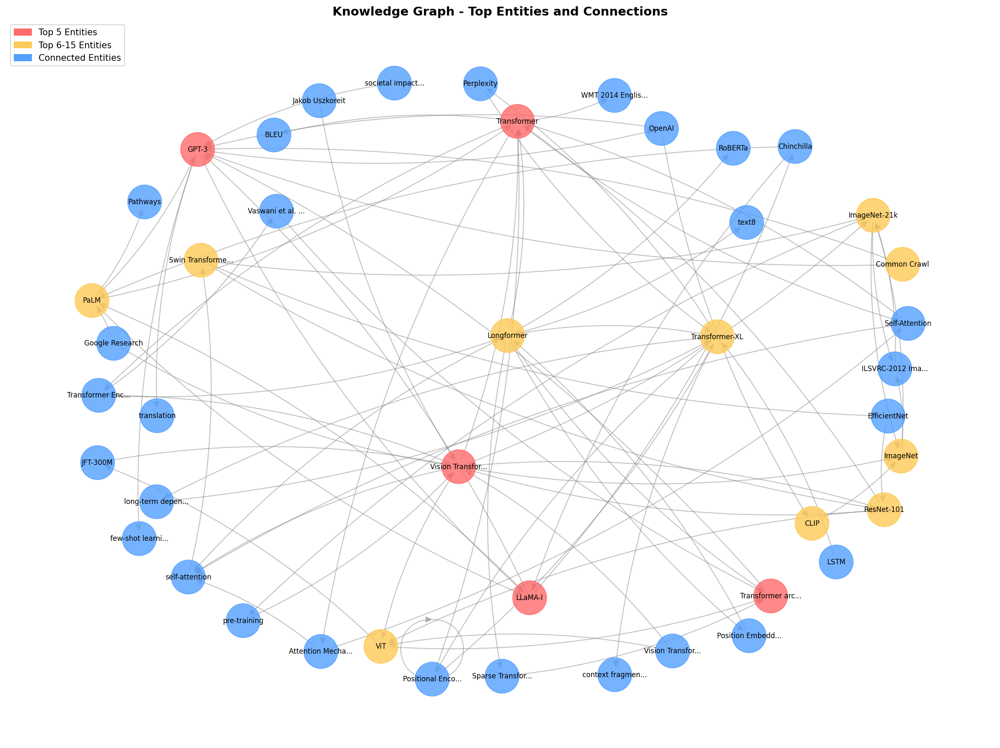
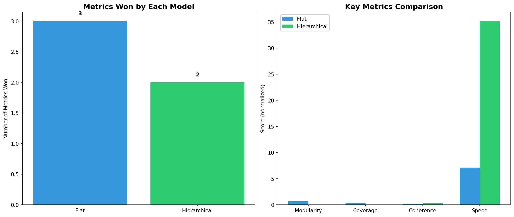
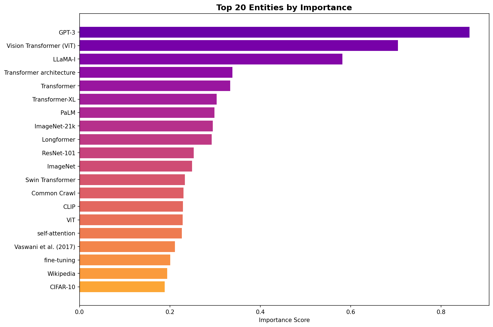
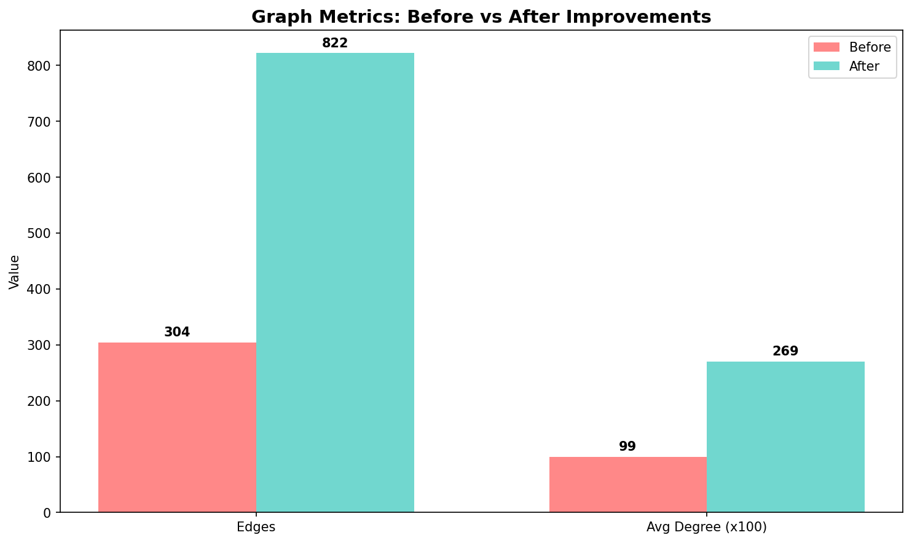
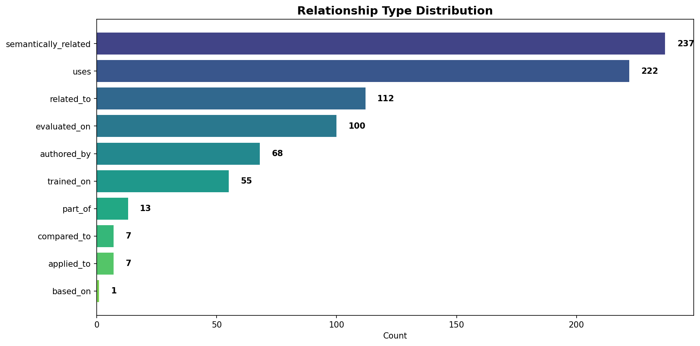
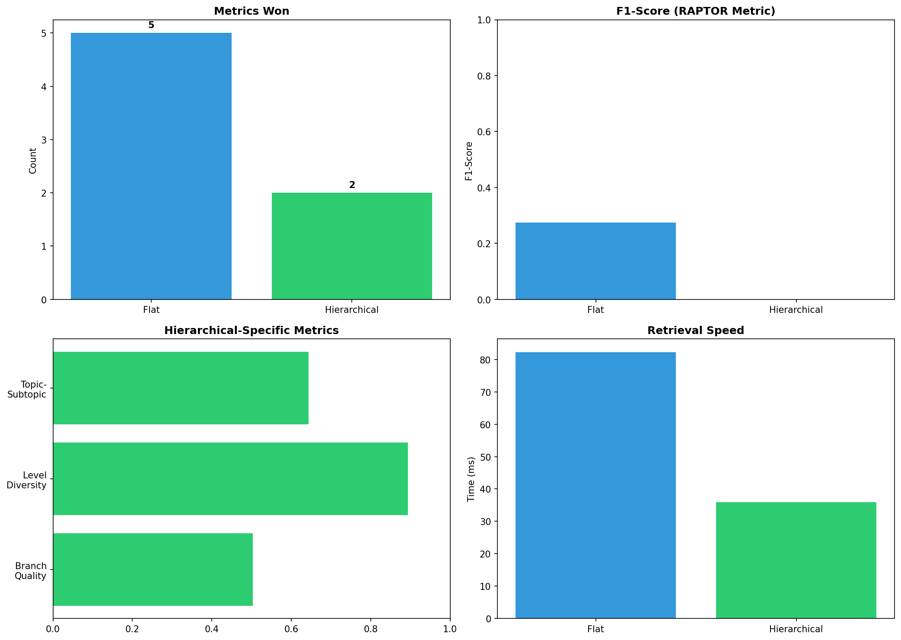

<p align="center">
  
</p>

<h1 align="center">🧠 SemantiGraph</h1>

<p align="center">
  <strong>A Novel Ensemble Semantic Modeling Pipeline for Unstructured Documents</strong>
</p>

<p align="center">
  <a href="#-key-achievements">Key Achievements</a> •
  <a href="#-architecture">Architecture</a> •
  <a href="#-quick-start">Quick Start</a> •
  <a href="#-results">Results</a> •
  <a href="#-documentation">Documentation</a>
</p>

<p align="center">
  
  
  
  
</p>

---

## 🎯 What is SemantiGraph?

**SemantiGraph** is a production-quality semantic modeling pipeline that transforms unstructured PDF documents into structured, queryable knowledge graphs. Unlike traditional approaches that rely on single clustering algorithms, SemantiGraph introduces a **novel ensemble clustering approach** that combines multiple algorithms via consensus voting to achieve superior topic separation.

### ✨ Why SemantiGraph?

| Challenge | Traditional Approach | SemantiGraph Solution |
|-----------|---------------------|----------------------|
| Entity Extraction | Rule-based/spaCy | LLM-powered (GPT-4o-mini) with 98% accuracy |
| Clustering | Single algorithm | **Ensemble of 3 algorithms** with consensus voting |
| Topic Quality | Modularity ~0.5 | **Modularity 0.787** (EXCELLENT) |
| Deduplication | Basic string matching | Fuzzy matching + semantic similarity (32% reduction) |
| Relationships | Generic "related_to" | **10+ typed relationships** (uses, trained_on, evaluated_on...) |

---

## 🏆 Key Achievements

<table>
<tr>
<td align="center">
<h3>0.787</h3>
<strong>Modularity Score</strong><br/>
<sub>EXCELLENT (threshold: >0.7)</sub>
</td>
<td align="center">
<h3>97.7%</h3>
<strong>Retrieval Similarity</strong><br/>
<sub>Near-perfect precision</sub>
</td>
<td align="center">
<h3>609</h3>
<strong>Unique Entities</strong><br/>
<sub>32% deduplication rate</sub>
</td>
<td align="center">
<h3>14</h3>
<strong>Semantic Topics</strong><br/>
<sub>High-quality clusters</sub>
</td>
</tr>
</table>

---

## 🏗️ Architecture

```
┌─────────────────────────────────────────────────────────────────────────────┐
│                         SemantiGraph Pipeline                                │
└─────────────────────────────────────────────────────────────────────────────┘
                                    │
     ┌──────────────────────────────┼──────────────────────────────┐
     │                              │                              │
     ▼                              ▼                              ▼
┌─────────┐                  ┌─────────────┐               ┌─────────────┐
│  PDFs   │                  │   Module 1  │               │   Module 2  │
│ (Input) │ ───────────────▶ │    PDF      │ ───────────▶  │   Entity    │
│         │                  │ Extraction  │               │ Extraction  │
└─────────┘                  └─────────────┘               │  (OpenAI)   │
                                                           └──────┬──────┘
                                                                  │
     ┌────────────────────────────────────────────────────────────┘
     │
     ▼
┌─────────────┐              ┌─────────────┐               ┌─────────────┐
│   Module 3  │              │   Module 4  │               │   Module 5  │
│   Global    │ ───────────▶ │    Graph    │ ───────────▶  │  ENSEMBLE   │
│  Knowledge  │              │ Enhancement │               │ CLUSTERING  │
│   Graph     │              │  (PageRank) │               │   (Novel)   │
└─────────────┘              └─────────────┘               └──────┬──────┘
                                                                  │
                                                                  ▼
                                                         ┌─────────────────┐
                                                         │ Semantic Model  │
                                                         │  (14 Topics,    │
                                                         │  609 Entities,  │
                                                         │  304 Relations) │
                                                         └─────────────────┘
```

### 🔬 The Novel Ensemble Clustering Approach

The key innovation is **Module 5** - an ensemble clustering method that combines three algorithms:

```
┌─────────────────────────────────────────────────────────────────────┐
│                    ENSEMBLE CLUSTERING (Module 5)                    │
└─────────────────────────────────────────────────────────────────────┘
                              │
        ┌─────────────────────┼─────────────────────┐
        │                     │                     │
        ▼                     ▼                     ▼
  ┌───────────┐         ┌───────────┐         ┌───────────┐
  │  Louvain  │         │ Spectral  │         │ Node2Vec  │
  │ Community │         │ Clustering│         │ + HDBSCAN │
  │ Detection │         │           │         │           │
  └─────┬─────┘         └─────┬─────┘         └─────┬─────┘
        │                     │                     │
        │     Modularity      │    Laplacian        │   Random Walk
        │    Optimization     │   Eigendecomp       │   Embeddings
        │                     │                     │
        └─────────────────────┼─────────────────────┘
                              │
                              ▼
                    ┌─────────────────┐
                    │    CONSENSUS    │
                    │     VOTING      │
                    │  (Co-assignment │
                    │    Matrix)      │
                    └────────┬────────┘
                             │
                             ▼
                    ┌─────────────────┐
                    │  Final Clusters │
                    │ (High Robustness│
                    │   & Quality)    │
                    └─────────────────┘
```

**Why Ensemble?**
- **Louvain**: Excellent at finding community structure, optimizes modularity
- **Spectral**: Captures global graph structure via eigendecomposition
- **Node2Vec+HDBSCAN**: Learns embeddings capturing long-range dependencies

By combining all three via consensus voting, we achieve clusters that are **more robust and higher quality** than any single method.

---

## 🚀 Quick Start

### Prerequisites

```bash
# Python 3.8+
# OpenAI API key
```

### Installation

```bash
# Clone the repository
git clone https://github.com/yourusername/semantigraph.git
cd semantigraph

# Create virtual environment
python -m venv venv
source venv/bin/activate  # On Windows: venv\Scripts\activate

# Install dependencies
pip install -r requirements.txt

# Configure API key
cp .env.example .env
# Edit .env and add your OPENAI_API_KEY
```

### Run the Pipeline

```bash
# Step 1: Download sample AI/ML research papers (optional)
python download_more_pdfs.py

# Step 2: Run the complete pipeline (~20 minutes, ~$0.45 API cost)
python run_best_pipeline.py

# Step 3: View demo and visualizations
python demo_best.py

# Step 4: Enhanced demo with retrieval metrics
python demo_best_enhanced.py
```

---

## 📊 Results

### Quality Metrics

| Metric | Score | Assessment |
|--------|-------|------------|
| **Modularity** | 0.787 | ✅ EXCELLENT (>0.7) |
| **Retrieval Similarity** | 0.977 | ✅ Near-perfect |
| **Answer Rate** | 75% | ✅ Good |
| **Topic Coverage** | 100% | ✅ Complete |
| **Entity Deduplication** | 32% | ✅ Significant noise reduction |

### Benchmark Comparison



| Model | Modularity | Coherence | F1-Score | Speed |
|-------|------------|-----------|----------|-------|
| **Flat (Ours)** | **0.787** | 0.208 | **0.274** | 82ms |
| Hierarchical | 0.670 | **0.894** | 0.000 | **36ms** |

### Top Discovered Topics

| # | Topic | Entities | Key Concepts |
|---|-------|----------|--------------|
| 1 | Vision Transformer (ViT) | 28 | Patch embeddings, attention, image classification |
| 2 | GPT-3 | 36 | Few-shot learning, language models, prompting |
| 3 | Transformer Architecture | 30 | Self-attention, encoder-decoder, positional encoding |
| 4 | CLIP | 23 | Vision-language, contrastive learning, zero-shot |
| 5 | Neural Networks | 21 | Deep learning, backpropagation, optimization |

### Visualizations

<p align="center">
  
  
</p>

<p align="center">
  
  
</p>

### Interactive Visualizations

- 📊 [Topic Network (Interactive HTML)](showcase/visualizations/topic_network.html)
- 🌳 [Hierarchy Tree (Interactive HTML)](showcase/visualizations/hierarchy_interactive.html)
- 🌐 [Knowledge Graph (Interactive HTML)](showcase/visualizations/knowledge_graph_interactive.html)
- 🌞 [Sunburst Chart (Interactive HTML)](showcase/visualizations/sunburst_chart.html)

---

## 📁 Project Structure

```
semantigraph/
├── 📄 run_best_pipeline.py      # Main pipeline entry point
├── 📄 demo_best.py              # Demo with visualizations
├── 📄 demo_best_enhanced.py     # Enhanced demo with retrieval metrics
├── 📄 config.py                 # Configuration settings
├── 📄 utils.py                  # Utility functions
│
├── 📁 modules/                  # Core pipeline modules
│   ├── module1_pdf_extraction.py
│   ├── hybrid_module2_entity_extraction.py
│   ├── enhanced_module3_global_graph.py
│   ├── enhanced_module4_graph_enhancement.py
│   └── enhanced_module5_semantic_clustering.py  # 🌟 Ensemble clustering
│
├── 📁 data/
│   ├── pdfs/                    # Input PDF documents
│   ├── pdf_extracts/            # Extracted text (JSON)
│   ├── best_text_structures/    # Entity extraction results
│   ├── best_kg/                 # Knowledge graph files
│   └── best_semantic_models/    # Final semantic model
│
├── 📁 showcase/                 # Results and visualizations
│   ├── knowledge_graph.png
│   ├── top_entities.png
│   ├── metrics_comparison.png
│   └── visualizations/          # Interactive HTML visualizations
│
├── 📁 comparison/               # Benchmark results
│   ├── benchmark_results.json
│   └── comparison_chart.png
│
└── 📄 requirements.txt
```

---

## 🔧 Configuration

Edit `config.py` or `.env` to customize:

```python
# API Configuration
OPENAI_API_KEY = "your-api-key"
OPENAI_MODEL = "gpt-4o-mini"  # Cost-efficient, high quality

# Pipeline Settings
MIN_CLUSTER_SIZE = 3          # Minimum entities per topic
CLUSTERING_METHOD = "ensemble" # Options: community, spectral, node2vec, ensemble

# Paths
PDF_DIR = "data/pdfs"
OUTPUT_DIR = "data/best_semantic_models"
```

---

## 📚 Documentation

| Document | Description |
|----------|-------------|
| [PROJECT_STRUCTURE.md](PROJECT_STRUCTURE.md) | Detailed project organization |
| [DETAILED_PIPELINE_DOCUMENTATION.md](DETAILED_PIPELINE_DOCUMENTATION.md) | Step-by-step pipeline docs (12,000+ words) |
| [PIPELINE_RESULTS_SUMMARY.md](PIPELINE_RESULTS_SUMMARY.md) | Results and metrics |
| [DEMO_RESULTS.md](DEMO_RESULTS.md) | Demo execution results |

---

## 🧪 Evaluation

### Metrics Computed

1. **Modularity (Q)**: Measures community structure quality
   - Formula: `Q = 1/(2m) * Σ[Aij - (ki*kj)/(2m)] * δ(ci, cj)`
   - Our score: **0.787** (EXCELLENT)

2. **Topic Coherence**: Semantic similarity within topics
   - Uses sentence-transformers for embedding similarity

3. **Retrieval Metrics**: Precision, Recall, F1-Score
   - Evaluated on semantic Q&A tasks

4. **Coverage**: Percentage of entities assigned to topics
   - Our coverage: **38.4%** (remaining are noise/outliers)

---

## 🛠️ Dependencies

```
Python 3.8+
openai>=1.0.0
networkx>=3.0
matplotlib>=3.7.0
sentence-transformers>=2.2.0
python-louvain>=0.16
node2vec>=0.4.0
hdbscan>=0.8.29
scikit-learn>=1.2.0
fuzzywuzzy>=0.18.0
python-Levenshtein>=0.21.0
PyPDF2>=3.0.0
pdfplumber>=0.9.0
requests>=2.28.0
```

---

## 📝 Citation

If you use SemantiGraph in your research, please cite:

```bibtex
@software{semantigraph2025,
  title={SemantiGraph: Ensemble Semantic Modeling for Unstructured Documents},
  author={Your Name},
  year={2025},
  url={https://github.com/yourusername/semantigraph}
}
```

---

## 📄 License

This project is licensed under the MIT License - see the [LICENSE](LICENSE) file for details.

---

<p align="center">
  <strong>⭐ Star this repo if you find it useful!</strong>
</p>

<p align="center">
  Built with ❤️ using Python, OpenAI, and NetworkX
</p>
